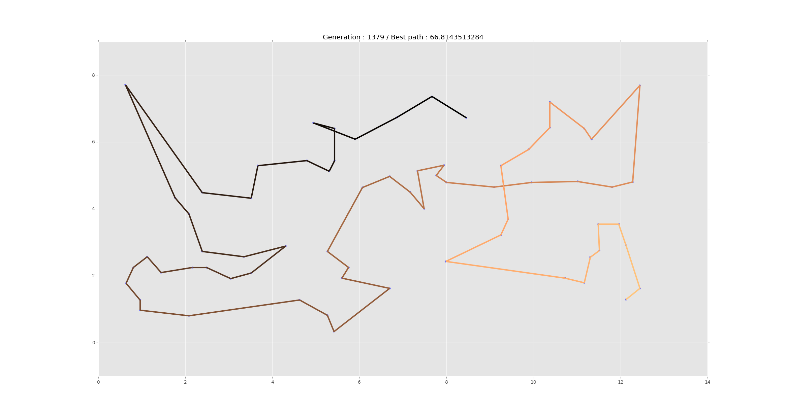

# Genetic Shortest Path

I wrote a [IPython notebook tutorial](http://maxhalford.com/resources/notebooks/genetic-algorithms) for genetic algorithms.

For this specific one, I inspired myself from [Randal Olson's blog post](http://www.randalolson.com/2015/02/03/heres-waldo-computing-the-optimal-search-strategy-for-finding-waldo/). However I tidied things up and packaged everything in an elegant way. As you can see there are three examples in the folder.

The ``waldo.py`` does exactly what Randal is doing in his blog post, however as you will see the graph is dynamic and quite pretty.

The ``capitals.py`` computes the shortest path for world capitals! You could theoretically estimate the shortest path between **all** the capitals but this would take a long time. For Europe this looks like the following image.

The map rendering is done with *Basemap*, which can quite annoying to install, you should either [follow this tutorial](https://peak5390.wordpress.com/2012/12/08/matplotlib-basemap-tutorial-installing-matplotlib-and-basemap/) or install it with *Anaconda* via ``conda install Basemap``.

``square.py`` very much ressembles ``capitals.py``